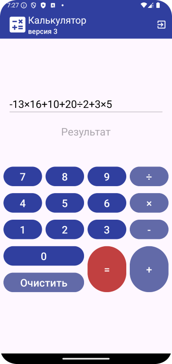
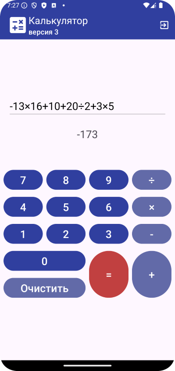
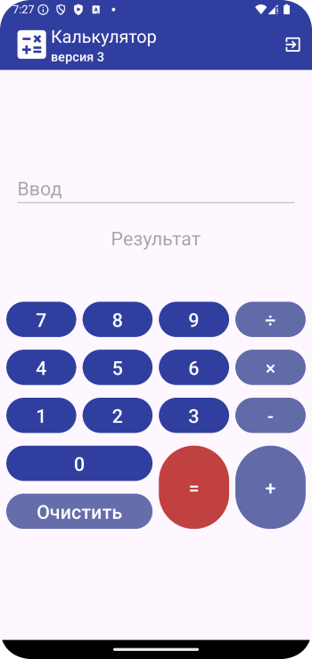
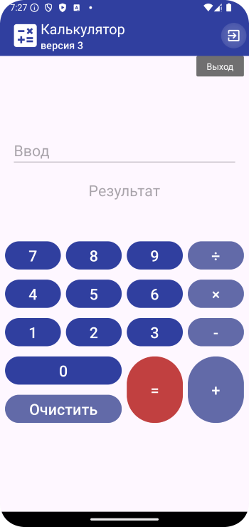

# Домашнее задание по теме "GridLayout, TableLayout"

### Апгрейд приложения «Калькулятор».
Необходимо написать калькулятор с учетом, что клавиатура ввода данных будет создана своя. Для того, чтобы клавиатура была скрыта при вводе данных можно использовать следующее `editTextET.isEnabled = false.`
                
Для написания приложения необходимо создать:

1. `Toolbar` с заголовком, цвет шрифта – белый.
2. Меню с пунктом для выхода `Exit`, цвет `icon` – белый.
3. Поле ввода, цвет шрифта – черный.
4. Поле вывода результата, цвет шрифта – черный.
5. Собственную клавиатуру, используя `GridLayout`, конфигурация отображена на скрине.

По нажатию на кнопки в поле ввода появляется вводимое выражение, допустим, 4+2=

По нажатию на кнопку равно в поле вывода появляется результат произведенной операции.

Приложение необходимо сохранить проектом в удаленном репозитории, для проверки качества предоставить ссылку преподавателю, либо сделать скрины эмулятора при каждом шаге работы приложения

### Скриншоты домашнего задания по теме "GridLayout, TableLayout"

 Скриншоты домашнего задания 

